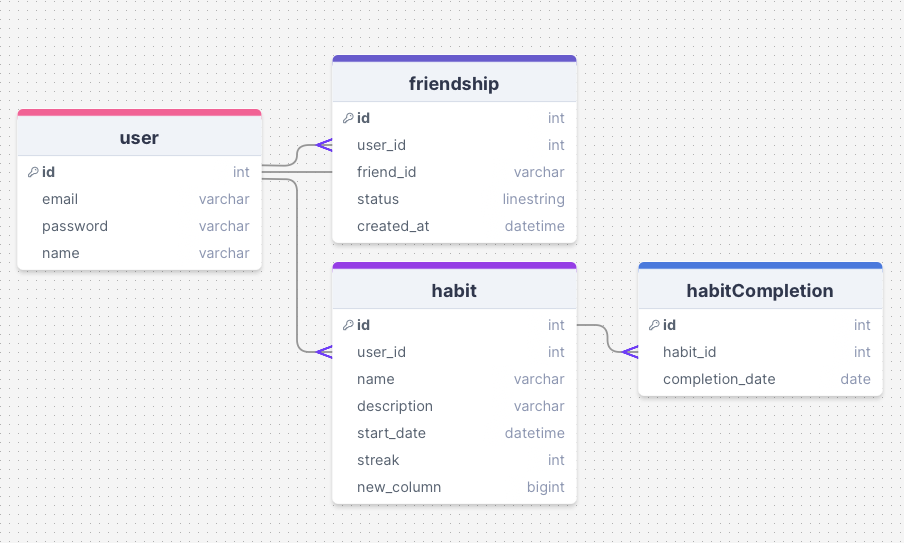

# Project Title

## Overview

What is your app? Give a brief description in a couple of sentences.

A habit tracker with an emphasis on a social element where you can connect and compete/encourage with friends.

### Problem Space

I've always struggled to stay consistent with habit building. While there are useful habit trackers available, the main pain points are as follows. 

First, there isn't any accountability to keep users consistent. Second, habit tracking is a habit you need to build, and unfortunately apps available right now don't have a lot of incentive for users to stay on track, other than streaks.  

By adding a social element to habit trackers, users will be more incentivised to stay consistent through additional accountability and friendly competition. 

### User Profile

- Young adults and teens into self development
    - looking for ways to build habits with friends and family 
    - track their progress digitally

### Features

- Sign up and login to account
- Habit creation, update, and deletion
- Habit visualization
- User profile and settings
- Social sharing: send friend requests, accept/delete request and share your habit data 
- Notifications and reminders for habits
- Leaderboards/competition with friends

## Implementation

### Tech Stack

Front End 
- React Native
- Library 
    - axios
    - react-router
    - react
    - React Native Paper

Back End 
- Node.js
    - Express.js
    - knex.js
- Database
    - MySQL
- Authentication
    - Firebase

### APIs

- No external APIs will be used for the first sprint

### Sitemap

- Register
- Login
- Homepage (view habits)
- Create habit page
- Edit habit page
- List of Friends and competition

### Mockups


### Data



### Endpoints

List endpoints that your server will implement, including HTTP methods, parameters, and example responses.

#### Register/Login User

**POST /auth/register**
- Add a user account
    Request: 
    ```
    {
        "email": email,
        "password": string,
        "name": string
    }
    ```

    Response:
    ```
    {
        "id": 1,
        "name": "name",
        "email": "name@email.com"
        "token": "seyJhbGciOiJIUzI1NiIsInR5cCI6IkpXVCJ9.eyJzdWIiOiIxMjM0NTY3ODkwIiwibmFtZSI6I..."
    }
    ```

**POST /auth/login**
- login to user account

    Parameters: 
    ```
    {
        "email": email,
        "password": string
    }
    ```

    Response:
    ```
    {
        "id": 1,
        "name": "name",
        "email": "name@email.com"
        "token": "seyJhbGciOiJIUzI1NiIsInR5cCI6IkpXVCJ9.eyJzdWIiOiIxMjM0NTY3ODkwIiwibmFtZSI6I..."
    }
    ```

#### Users

**GET /users/**
- Retrieve all users

    Response:
    ```
    [
        {"id":1,"email":"alice@example.com","name":"Alice"},
        {"id":2,"email":"bob@example.com","name":"Bob"},
        {"id":3,"email":"charlie@example.com", "name":"Charlie"},
        {"id":4,"email":"david@example.com","name":"David"},
        {"id":5,"email":"emma@example.com","name":"Emma"},
        {"id":6,"email":"frank@example.com","name":"Frank"},
        {"id":7,"email":"grace@example.com","name":"Grace"},
        {"id":8,"email":"hannah@example.com","name":"Hannah"}
    ]

    ```

**GET /users/:id**
- Retrieve user's profile with specific id
    Response:
    ```
    {
        "id":1,
        "email":"alice@example.com",
        "name":"Alice"
    }
    ```

**PUT /users/:id**
- update user's information

    Parameters: 
    ````
    {
        "email":"alice@example.com",
        "name":"Alexander",
    }
    ````

    Response:
    ```
    {
        "id":1,
        "email":"alice@example.com",
        "name":"Alexander"
    }
    ```

#### Friends
**GET /friends/:user_id**
- get the list of friends for a particular user and their information
    Response: 
    ```
    [
        {
            "id": 1,
            "name": "Alex",
            "status": "accepted"
        },
        {
            "id": 2,
            "name": "Amanda",
            "status": "accepted"
        }
    ]
    ```

**POST /friends/:user_id**
- send a friend request to a specified user
    Parameter:
    ```
    {
        "friend_id": 2
    }
    ```
    Response:
    ```
    {
        "status": "pending"
    }


**PUT /friends/:user_id**
- accept or block a friend request 
    Parameter:
    ```
    {
        "friend_id": 1,
        "status": "accepted"
    }
    ```
    Response:
    ```
    200 OK


#### Habits
**GET /habits/:user_id**
- fetch all habits for a user
    Response:
    ```
    [
        {   
        "id": 1,
        "habit_name": "swimming",
        "completed_on": [
            '2025-01-01',
            '2025-01-02',
            '2025-01-03'
        ]
        }, 
        {   
        "id": 2,
        "habit_name": "drinking water",
        "completed_on": [
            '2025-01-01',
            '2025-01-02',
            '2025-01-03'
        ]
        }
    ]
    ```

**POST /habits/:user_id**
- create a habit for particular user
    Parameter: 
    ```
    {
        "habit_name": "swimming",
    }
    ```
    Response:
    ```
    {
        "id": "swimming",
        "user_id": 1,
        "habit_name": "swimming",
        "created_at": 2025-01-14 10:35:57
    }
    ```

**PUT /habits/:user_id/**
- update habits for user
    Parameters: 
    ````
    {
        "habit_name": "Swimming 2.0"
    }
    ````

    Response:
    ```
    {   
        "id": 2,
        "user_id": 1,
        "habit_name": "Swimming 2.0",
    }
    ```
**PUT /habits/:user_id/:habit_id**
- update habit completion details 
    Parameters: 
    ````
    {
        "id": 2,
        "habit_name": "Swimming"
        "completed_on": [
            '2025-01-01',
            '2025-01-02',
            '2025-01-03'
        ]
    }
    ````
        Response:
    ```
    {   
        "id": 2,
        "habit_name": "Swimming"
        "completed_on": [
            '2025-01-01',
            '2025-01-02',
            '2025-01-03'
        ]
    }
    ```
**DELETE /habits/:user_id** 
- delete a habit for user
    Parameter: 
    ```
    {
        "id": 1
    }
    ```
    Response:
    ```
    {
        "id": 1,
        "user_id": 1,
        "habit_name": "Swimming 2.0"
    }
    ```

#### Habit Tracking
**POST /habits/:id/completions**
- add a record of habit completion for a specific date
    Parameters: 
    ````
    {
        "completion_date": 2025-01-02,
    }
    ````

    Response:
    ```
    {   
        "id": 1,
        "habit_id": 1,
        "completion_date": 2025-01-02
    }
    ```

**DELETE /habits/:id/completions**
- delete a record of habit completion for a specific date
    Parameter:
    ```
    {
        "completion_date": 2025-01-02
    }
    ```
    Response:
    ```
    200 OK
    ```

**GET /habits/:id/completions**
- Get a list of the days in which the habit was completed
    Response:
    ```
    [
        2025-01-01,
        2025-01-02,
        2025-01-03,
        2025-01-04,
    ]
    ```


---

## Future Implementations
- login and authentication
- social features: sending friend requests to other users

