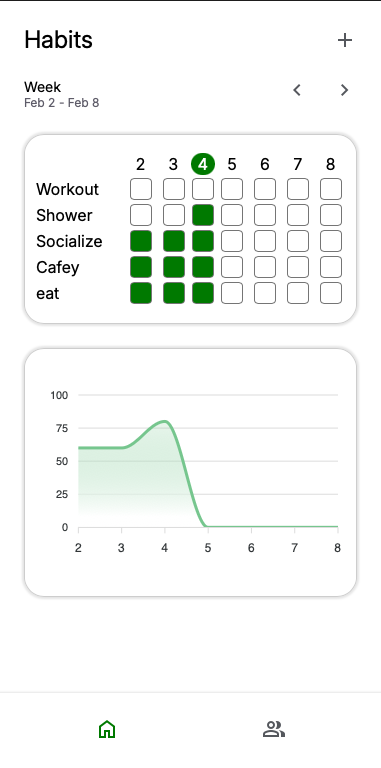
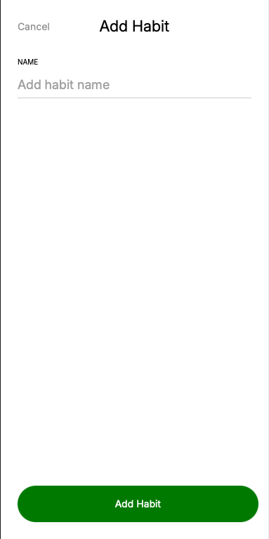
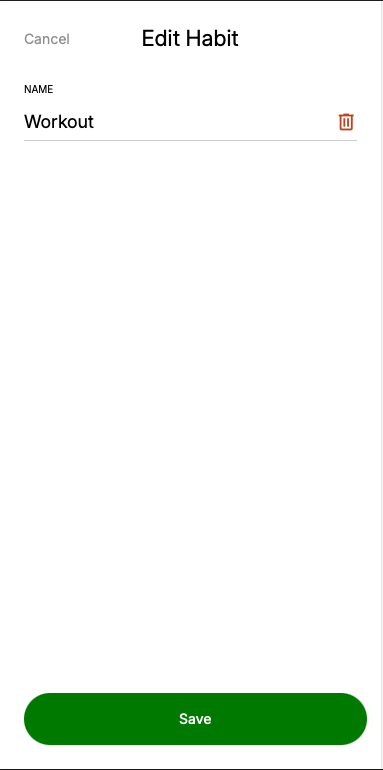
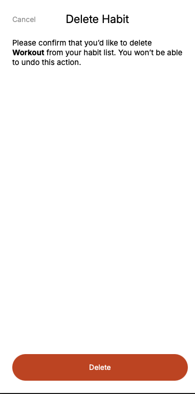
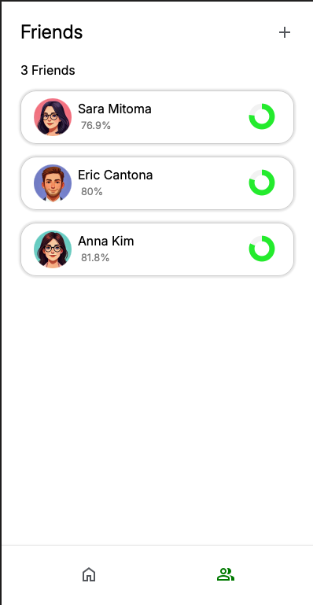

# 📅 Social Habit Tracker

A minimialistic habit tracker where users can connect and compete with friends for extra fun and accountability.

### 🚀 Features
- **Habit management**: creation, update, and deletion
- **Visualize habits**: graph view of habit completion trends
- **Friend list**: see the progress your friends are making 
- More features coming!
- [Watch the presentation](https://www.loom.com/share/c2af9b77023d48e386eb622bd7a75557?sid=a06e9b64-5029-44ec-80c5-631755b1ca63)

### 🛠️ Tech Stack

**Front End:** React, Sass, Axios
**Back End:** Node.js, Express, Knex, MySQL
[Backend Repo](https://github.com/rmasuda12/habit-tracker-backend)

## 📦 Installation & Setup

#### Clone the Repository
```bash
git clone https://github.com/rmasuda12/habit-tracker-frontend.git
cd habit-tracker-frontend
```
#### Download Dependencies
```bash
npm install
```
#### Set Up Environment Variables
create .env file in the root directory
```env
VITE_API_URL: "http://localhost:[port number]"
```

#### Initialize Backend
Follow steps for installing and setting up the [Backend Repo](https://github.com/rmasuda12/habit-tracker-backend)

#### Start app
```bash
npm start
```

## Implementation

### Sitemap

- **HomePage**

- **Create Habit**

- **Edit Habit**

- **Delete Habit**

- **Friends Page**


For more details see my [Figma Mock Up](https://www.figma.com/design/5A037qDpKMHhi07R120DAU/Habit-Tracker?m=auto&t=0NKOGAIiGJOpEGI7-6)

---

### Future Implementations
- login and authentication
- More detailed view of habit stats
- Leaderboards/competition with friends
- social features: sending friend requests to other users

## License
This project is licensed under the MIT License

## Contact
For questions, reach out via: 
Email: masudarinta@gmail.com
